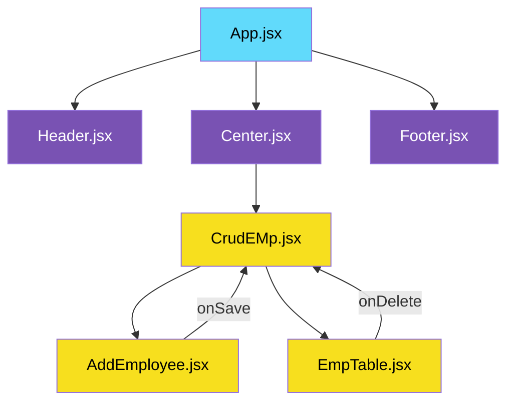

# Anis Shaikh


# 📋 Employee Management System

> A complete React application with **Create, Read, and Delete** functionality for managing employees with a modern, responsive UI.

---

## 🚀 Live Demo

[](https://your-app.netlify.app)
[](https://your-app.vercel.app)

---

## ✨ Features

<table align="center">
  <tr>
    <td align="center">📋</td>
    <td align="center">➕</td>
    <td align="center">🗑️</td>
    <td align="center">🔍</td>
    <td align="center">✏️</td>
    <td align="center">📱</td>
  </tr>
  <tr>
    <td align="center"><b>View Employees</b><br/>✅ Working</td>
    <td align="center"><b>Add Employee</b><br/>✅ Working</td>
    <td align="center"><b>Delete Employee</b><br/>✅ Working</td>
    <td align="center"><b>Search</b><br/>🚧 Coming Soon</td>
    <td align="center"><b>Edit Employee</b><br/>🚧 Coming Soon</td>
    <td align="center"><b>Responsive</b><br/>✅ Working</td>
  </tr>
</table>

---

## 🛠️ Tech Stack

<div align="center">


</div>

---

## 📸 Screenshots

<div align="center">
  
### 🏠 Home Page


### 📊 Employee Table


### ➕ Add Employee Modal


</div>

## 🧩 Project Architecture


---

## 📁 Project Structure


## 📁 Project Structure

```
employee-management/
├── 📦 public/
│   └── 🖼️ vite.svg
├── 📂 src/
│   ├── 📂 components/
│   │   ├── 📂 header/
│   │   │   └── 📄 Header.jsx          # 🏷️ Navigation Bar
│   │   ├── 📂 footer/
│   │   │   ├── 📄 Footer.jsx          # 🦶 Footer Component
│   │   │   └── 🎨 Footer.css          # Footer Styles
│   │   ├── 📂 center/
│   │   │   └── 📄 Center.jsx          # 🎯 Main Content Wrapper
│   │   └── 📂 crud-emp/
│   │       ├── 📄 CrudEMp.jsx         # 🧠 Main CRUD Logic
│   │       ├── 📄 EmpTable.jsx        # 📊 Employee Table
│   │       └── 📄 AddEmployee.jsx     # ➕ Add Employee Modal
│   ├── 📄 App.jsx                      # 🚀 Root Component
│   ├── 🎨 App.css                      # Global Styles
│   └── 🔥 main.jsx                     # Entry Point
├── 📄 package.json                     # 📦 Dependencies
├── 📄 README.md                        # 📖 Documentation
└── 🚫 .gitignore                       # Git Ignore
```
